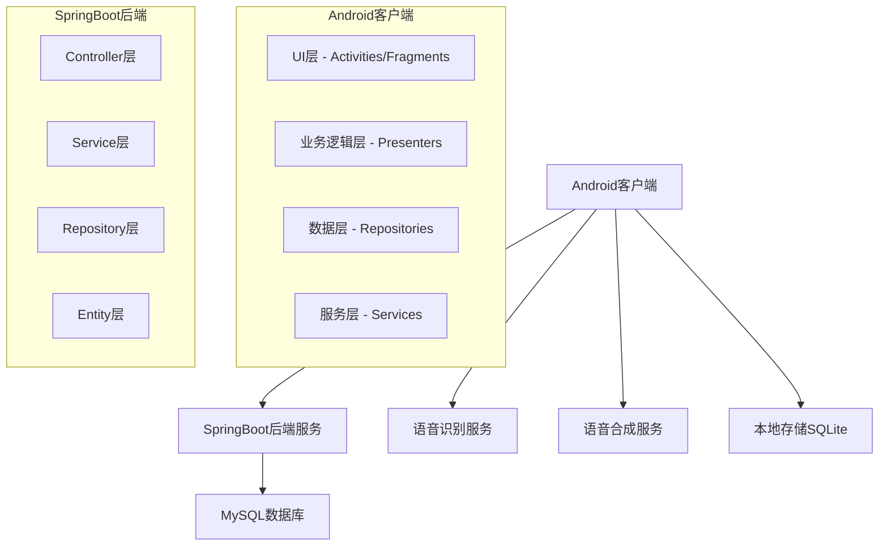

# 设计文档

## 概述

日程安排语音提醒APP采用Android原生开发，结合SpringBoot后端服务和MySQL数据库，构建一个功能完整的语音交互日程管理系统。应用采用MVP架构模式，确保代码的可维护性和可扩展性。

## 架构设计

### 系统架构图



### 技术栈

**Android端：**
- 开发语言：Java
- 最低SDK版本：API 21 (Android 5.0)
- 目标SDK版本：API 33 (Android 13)
- 架构模式：MVP (Model-View-Presenter)
- 语音识别：Android Speech Recognition API + 百度语音SDK
- 语音合成：Android TextToSpeech + 科大讯飞语音SDK
- 本地数据库：SQLite + Room
- 网络请求：Retrofit2 + OkHttp3
- 依赖注入：Dagger2
- UI框架：Material Design Components

**后端服务：**
- 框架：SpringBoot 2.7.x
- 数据库：MySQL 8.0
- ORM：MyBatis Plus
- 安全框架：Spring Security + JWT
- API文档：Swagger3
- 缓存：Redis
- 消息队列：RabbitMQ (用于定时提醒)

## UI设计

### 主要界面设计

#### 1. 主界面 (MainActivity)
- **顶部导航栏**：显示当前日期，设置按钮
- **中央区域**：今日日程列表，支持上下滑动
- **底部导航栏**：
  - 日程 (Schedule)
  - 语音 (Voice) 
  - 设置 (Settings)
  - 帮助 (Help)
- **悬浮按钮**：快速添加日程 (+)

#### 2. 日程管理界面 (ScheduleActivity)
- **工具栏**：搜索框，筛选按钮，批量操作
- **列表区域**：
  - 日程卡片显示：标题、时间、地点、状态
  - 支持左滑删除，右滑编辑
  - 长按多选模式
- **底部操作栏**：添加、批量导入、同步

#### 3. 添加/编辑日程界面 (AddScheduleActivity)
- **表单区域**：
  - 标题输入框 (支持语音输入)
  - 日期时间选择器
  - 地点输入框 (支持语音输入)
  - 描述文本框 (支持语音输入)
  - 提醒设置 (时间、重复、语音主题)
- **语音输入按钮**：每个输入框旁边的麦克风图标
- **操作按钮**：保存、取消、预览语音

#### 4. 语音设置界面 (VoiceSettingsActivity)
- **语音主题选择**：
  - 预设主题列表 (男声、女声、儿童声等)
  - 自定义语音包导入
- **播报设置**：
  - 音量调节滑块
  - 语速调节滑块
  - 重复次数设置
  - 间隔时间设置
- **个性化语音**：
  - 录制自定义语音
  - 常用语音管理

#### 5. 帮助学习界面 (HelpActivity)
- **引导教程**：分步骤介绍功能
- **功能演示**：交互式操作指导
- **常见问题**：FAQ列表
- **学习进度**：完成状态和成就展示

### UI设计规范

**颜色方案：**
- 主色调：#2196F3 (蓝色)
- 辅助色：#FFC107 (琥珀色)
- 背景色：#FAFAFA (浅灰)
- 文字色：#212121 (深灰)
- 提示色：#4CAF50 (绿色) / #F44336 (红色)

**字体规范：**
- 标题：18sp, 粗体
- 正文：14sp, 常规
- 辅助文字：12sp, 浅色
- 按钮文字：16sp, 中等粗细

## 组件和接口设计

### Android端核心组件

#### 1. 数据模型 (Model)
```java
// 日程实体类
public class Schedule {
    private Long id;
    private String title;
    private String description;
    private String location;
    private Date startTime;
    private Date endTime;
    private int reminderType;
    private String voiceTheme;
    private boolean isCompleted;
    // getter/setter方法
}

// 语音主题实体类
public class VoiceTheme {
    private String themeId;
    private String themeName;
    private String voiceType;
    private String packagePath;
    private boolean isDefault;
    // getter/setter方法
}
```

#### 2. 数据访问层 (Repository)
```java
public interface ScheduleRepository {
    List<Schedule> getAllSchedules();
    Schedule getScheduleById(Long id);
    void insertSchedule(Schedule schedule);
    void updateSchedule(Schedule schedule);
    void deleteSchedule(Long id);
    List<Schedule> getSchedulesByDate(Date date);
}
```

#### 3. 业务逻辑层 (Presenter)
```java
public class SchedulePresenter {
    private ScheduleView view;
    private ScheduleRepository repository;
    
    public void loadSchedules();
    public void addSchedule(Schedule schedule);
    public void updateSchedule(Schedule schedule);
    public void deleteSchedule(Long id);
    public void searchSchedules(String keyword);
}
```

#### 4. 语音服务 (Service)
```java
public class VoiceService extends Service {
    // 语音识别功能
    public void startSpeechRecognition();
    public void stopSpeechRecognition();
    
    // 语音播报功能
    public void speakText(String text, String voiceTheme);
    public void stopSpeaking();
    
    // 定时提醒功能
    public void scheduleReminder(Schedule schedule);
    public void cancelReminder(Long scheduleId);
}
```

### SpringBoot后端接口设计

#### 1. 日程管理API
```java
@RestController
@RequestMapping("/api/schedules")
public class ScheduleController {
    
    @GetMapping
    public ResponseEntity<List<Schedule>> getAllSchedules();
    
    @GetMapping("/{id}")
    public ResponseEntity<Schedule> getScheduleById(@PathVariable Long id);
    
    @PostMapping
    public ResponseEntity<Schedule> createSchedule(@RequestBody Schedule schedule);
    
    @PutMapping("/{id}")
    public ResponseEntity<Schedule> updateSchedule(@PathVariable Long id, @RequestBody Schedule schedule);
    
    @DeleteMapping("/{id}")
    public ResponseEntity<Void> deleteSchedule(@PathVariable Long id);
    
    @GetMapping("/date/{date}")
    public ResponseEntity<List<Schedule>> getSchedulesByDate(@PathVariable String date);
    
    @PostMapping("/batch")
    public ResponseEntity<List<Schedule>> batchCreateSchedules(@RequestBody List<Schedule> schedules);
}
```

#### 2. 用户管理API
```java
@RestController
@RequestMapping("/api/users")
public class UserController {
    
    @PostMapping("/register")
    public ResponseEntity<User> register(@RequestBody UserRegistrationDto dto);
    
    @PostMapping("/login")
    public ResponseEntity<AuthResponse> login(@RequestBody LoginDto dto);
    
    @GetMapping("/profile")
    public ResponseEntity<User> getUserProfile();
    
    @PutMapping("/settings")
    public ResponseEntity<UserSettings> updateSettings(@RequestBody UserSettings settings);
}
```

## 数据模型设计

### MySQL数据库表结构

#### 1. 用户表 (users)
```sql
CREATE TABLE users (
    id BIGINT PRIMARY KEY AUTO_INCREMENT,
    username VARCHAR(50) UNIQUE NOT NULL,
    email VARCHAR(100) UNIQUE NOT NULL,
    password_hash VARCHAR(255) NOT NULL,
    created_at TIMESTAMP DEFAULT CURRENT_TIMESTAMP,
    updated_at TIMESTAMP DEFAULT CURRENT_TIMESTAMP ON UPDATE CURRENT_TIMESTAMP
);
```

#### 2. 日程表 (schedules)
```sql
CREATE TABLE schedules (
    id BIGINT PRIMARY KEY AUTO_INCREMENT,
    user_id BIGINT NOT NULL,
    title VARCHAR(200) NOT NULL,
    description TEXT,
    location VARCHAR(200),
    start_time DATETIME NOT NULL,
    end_time DATETIME,
    reminder_time DATETIME,
    reminder_type TINYINT DEFAULT 1,
    voice_theme VARCHAR(50) DEFAULT 'default',
    is_completed BOOLEAN DEFAULT FALSE,
    created_at TIMESTAMP DEFAULT CURRENT_TIMESTAMP,
    updated_at TIMESTAMP DEFAULT CURRENT_TIMESTAMP ON UPDATE CURRENT_TIMESTAMP,
    FOREIGN KEY (user_id) REFERENCES users(id) ON DELETE CASCADE
);
```

#### 3. 语音主题表 (voice_themes)
```sql
CREATE TABLE voice_themes (
    id VARCHAR(50) PRIMARY KEY,
    theme_name VARCHAR(100) NOT NULL,
    voice_type VARCHAR(20) NOT NULL,
    package_url VARCHAR(500),
    is_default BOOLEAN DEFAULT FALSE,
    created_at TIMESTAMP DEFAULT CURRENT_TIMESTAMP
);
```

#### 4. 用户设置表 (user_settings)
```sql
CREATE TABLE user_settings (
    id BIGINT PRIMARY KEY AUTO_INCREMENT,
    user_id BIGINT UNIQUE NOT NULL,
    default_voice_theme VARCHAR(50) DEFAULT 'default',
    voice_volume FLOAT DEFAULT 0.8,
    voice_speed FLOAT DEFAULT 1.0,
    reminder_repeat_count INT DEFAULT 3,
    reminder_interval INT DEFAULT 300,
    created_at TIMESTAMP DEFAULT CURRENT_TIMESTAMP,
    updated_at TIMESTAMP DEFAULT CURRENT_TIMESTAMP ON UPDATE CURRENT_TIMESTAMP,
    FOREIGN KEY (user_id) REFERENCES users(id) ON DELETE CASCADE
);
```

### Android本地数据库 (SQLite)

#### Room数据库实体
```java
@Entity(tableName = "local_schedules")
public class LocalSchedule {
    @PrimaryKey
    public Long id;
    
    @ColumnInfo(name = "server_id")
    public Long serverId;
    
    @ColumnInfo(name = "title")
    public String title;
    
    @ColumnInfo(name = "start_time")
    public Date startTime;
    
    @ColumnInfo(name = "is_synced")
    public boolean isSynced;
    
    // 其他字段...
}
```

## 错误处理

### 客户端错误处理策略

1. **网络错误**：
   - 自动重试机制 (最多3次)
   - 离线模式支持
   - 用户友好的错误提示

2. **语音识别错误**：
   - 识别失败时提供手动输入选项
   - 噪音环境检测和提示
   - 多语言识别支持

3. **数据同步错误**：
   - 冲突解决策略 (服务器优先)
   - 增量同步机制
   - 数据备份和恢复

### 服务端错误处理

1. **全局异常处理器**：
```java
@ControllerAdvice
public class GlobalExceptionHandler {
    
    @ExceptionHandler(ValidationException.class)
    public ResponseEntity<ErrorResponse> handleValidation(ValidationException e);
    
    @ExceptionHandler(ResourceNotFoundException.class)
    public ResponseEntity<ErrorResponse> handleNotFound(ResourceNotFoundException e);
    
    @ExceptionHandler(Exception.class)
    public ResponseEntity<ErrorResponse> handleGeneral(Exception e);
}
```

2. **错误响应格式**：
```json
{
    "error": {
        "code": "VALIDATION_ERROR",
        "message": "输入数据验证失败",
        "details": ["标题不能为空", "时间格式不正确"]
    },
    "timestamp": "2024-01-20T10:30:00Z"
}
```

## 测试策略

### Android端测试

1. **单元测试**：
   - Presenter层业务逻辑测试
   - Repository层数据访问测试
   - 工具类方法测试

2. **集成测试**：
   - 数据库操作测试
   - 网络请求测试
   - 语音功能测试

3. **UI测试**：
   - Espresso自动化测试
   - 用户交互流程测试
   - 界面响应测试

### 后端测试

1. **单元测试**：
   - Service层业务逻辑测试
   - Repository层数据访问测试
   - 工具类测试

2. **集成测试**：
   - API接口测试
   - 数据库集成测试
   - 缓存功能测试

3. **性能测试**：
   - 接口响应时间测试
   - 并发访问测试
   - 数据库查询优化测试

## 部署和运维

### 开发环境配置

1. **Android开发环境**：
   - Android Studio Arctic Fox或更高版本
   - JDK 11
   - Android SDK API 21-33
   - 模拟器或真机测试设备

2. **后端开发环境**：
   - IntelliJ IDEA或Eclipse
   - JDK 11
   - Maven 3.6+
   - MySQL 8.0
   - Redis 6.0+

### 生产环境部署

1. **后端服务部署**：
   - Docker容器化部署
   - Nginx反向代理
   - SSL证书配置
   - 数据库主从配置

2. **监控和日志**：
   - 应用性能监控 (APM)
   - 日志收集和分析
   - 错误报告和告警

## 安全考虑

1. **数据安全**：
   - 用户密码加密存储
   - 敏感数据传输加密
   - 本地数据库加密

2. **API安全**：
   - JWT令牌认证
   - 接口访问频率限制
   - 输入数据验证和过滤

3. **隐私保护**：
   - 语音数据本地处理
   - 用户数据匿名化
   - 符合GDPR等隐私法规